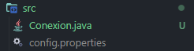
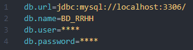

## Estructura

- `src`: las clases y configuraciones
- `lib`: bibliotecas o dependencias

Los archivos compilados están en la carpeta `bin`, los archivos dentro de la carpeta son ignorados por git para evitar sobrecarga

> `.vscode/settings.json`: Configuración de las rutas en vsCode, puedes ignorarlo si usas otro editor pero NO BORRAR

## Configurar Base de Datos

- Crear un archivo `"config.properties"` en `src`

- Colocar el contenido en el siguiente formato

- Reemplazar según sea necesario tanto el usuario `(root u otro)` como la contraseña, se puede cambiar tambien la BD que hace referencia y el puerto localhost en uso.